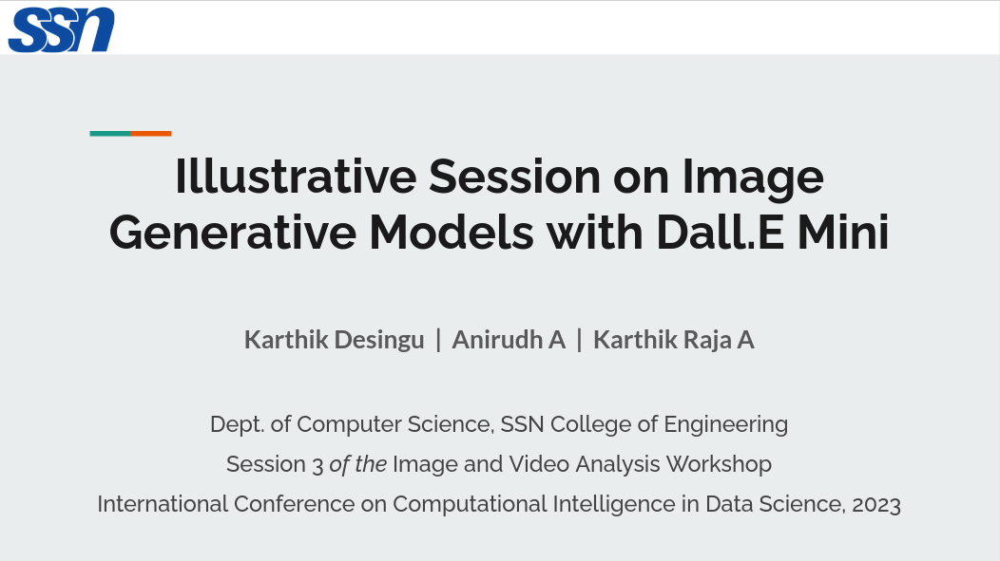

# Illustrative Workshop on Image Generative Models with Dall.E Mini

> A conference workshop on [Image and Video Analysis](https://sites.google.com/ssn.edu.in/iva-2023) as part of the [IFIP-Springer International Conference on Computational Intelligence for Data Science (ICCIDS)](http://www.iccids.in/), 2023 jointly organized by the **Machine Learning Research Group** and the [Department of CSE, SSN College of Engineering](https://www.ssn.edu.in/college-of-engineering/computer-science-and-engineering-department-ssn-institutions/), Chennai, India.

- [Link to Illustration Notebooks](./Notebooks)
  - **Vanilla GAN** for Image Regeneration: MNIST data.
  - **Autoencoders** for Image Regeneration: CIFAR10 data.
  - **Variational Autoencoders** for Image Regeneration: CIFAR10 data.
  - **Vector-Quantized Variational Autoencoders** for Image Regeneration: CIFAR10 data.
  - **BART** for Encoding Text Captions.
  - **CLIP** to Rank Images by Relevance to Caption.
- [Link to Workshop Slides](./Slides/DallE-Mini_Compiled-Presentation.pdf)

## Session Overview

- Overview of Dall.E Mini and its Building Blocks
- A Brief Antedate of Autoencoders and Generative Adversarial Networks (GANs) applied in Dall.E Mini
- BART Encoder-Decoder for Image-Text Latent Space Tranlation
- CLIP to Rank Generated Images by Relevance to Captions
- Piecing the blocks of Dall.E Mini together

**Implemented with**: Python, PyTorch

